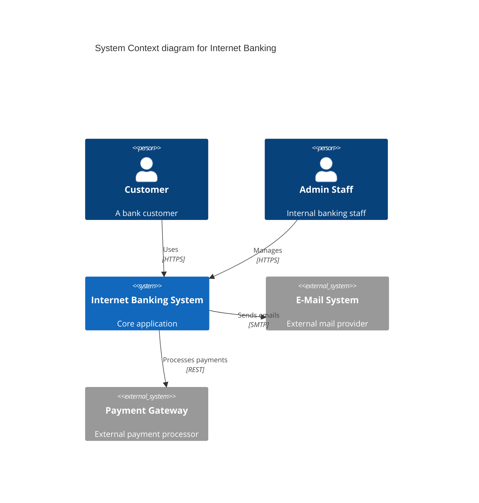
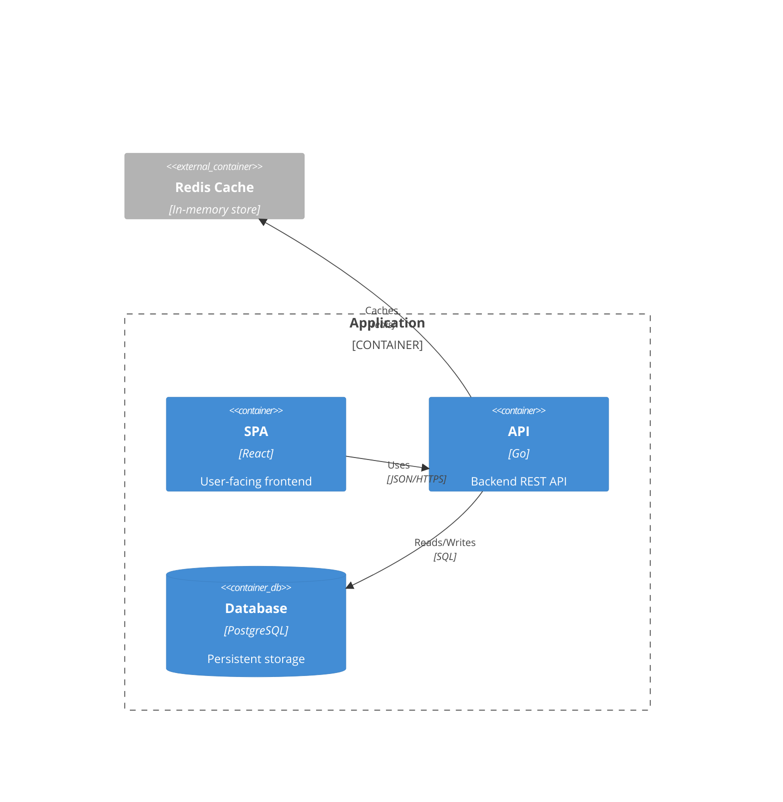
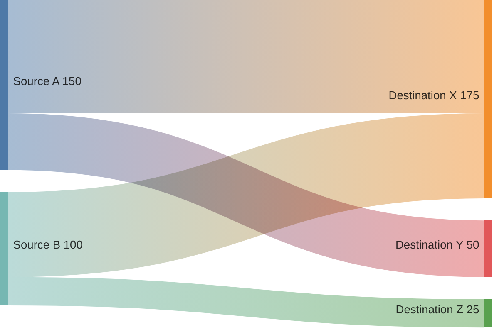
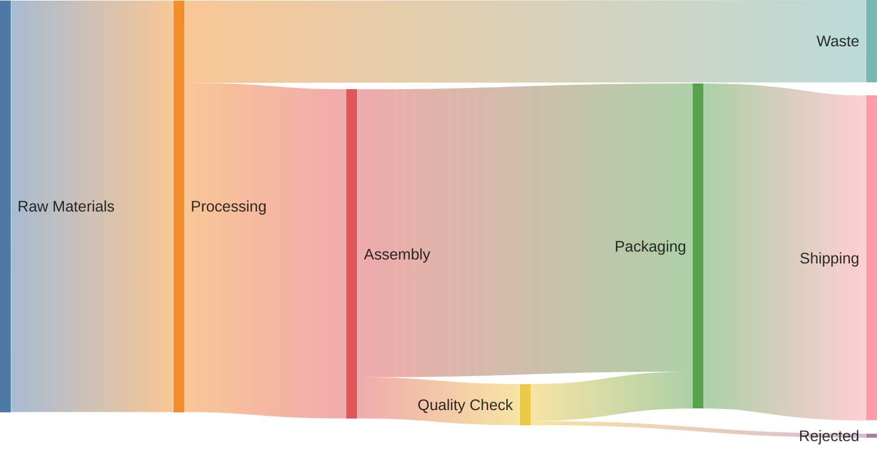
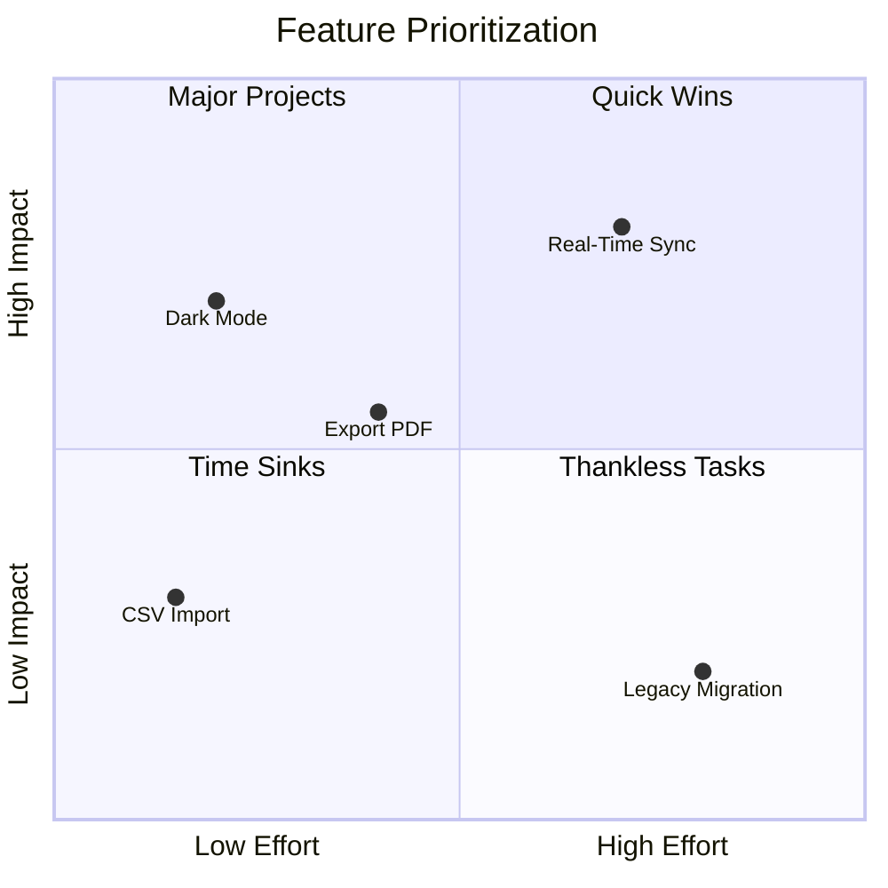
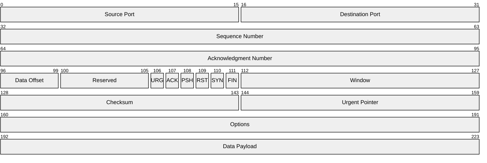
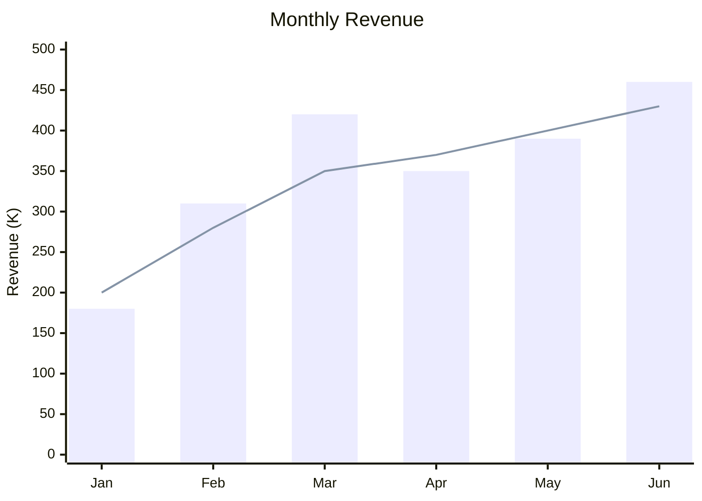
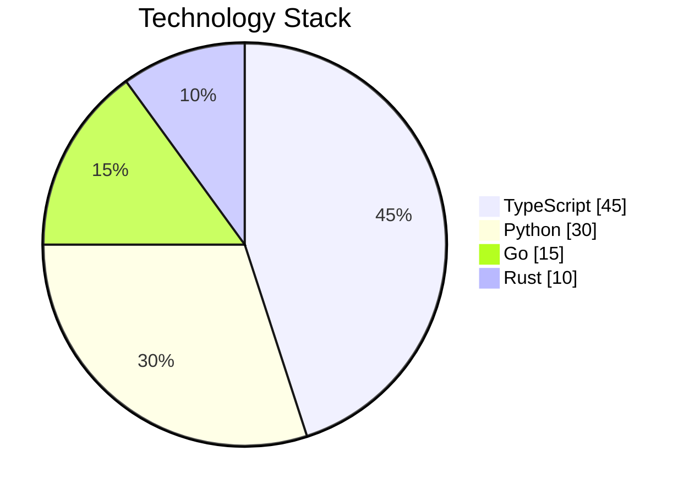
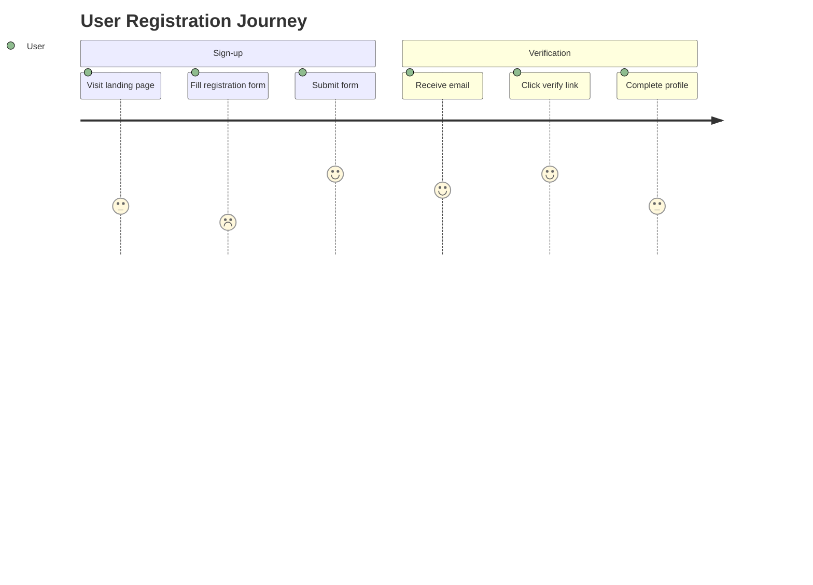

# Prompt Guide

## Getting Good Diagrams

Be specific about **what** flows and **who** participates. Vague prompts produce vague diagrams.

## Flowchart Patterns

### Basic Flow
```
graph TD
    A[Start] --> B{Decision}
    B -->|Yes| C[Process]
    B -->|No| D[End]
```

### Auth Flow
```
graph LR
    A[User] -->|login creds| B[Auth Service]
    B -->|JWT| C[API Gateway]
    C -->|verify| D[User Service]
    D -->|data| A
```

### CI/CD Pipeline
```
graph TD
    A[Push] --> B[Build]
    B --> C{Success?}
    C -->|Yes| D[Test]
    C -->|No| E[Notify]
    D --> F{Pass?}
    F -->|Yes| G[Deploy]
    F -->|No| E
```

### Decision Tree
```
graph TD
    A[Request] --> B{Auth?}
    B -->|Invalid| C[401 Unauthorized]
    B -->|Valid| D{Rate Limit?}
    D -->|Exceeded| E[429 Too Many]
    D -->|OK| F[Process]
```

## Sequence Diagram Patterns

### API Call with Auth
```
sequenceDiagram
    participant C as Client
    participant A as Auth Service
    participant API as API Gateway
    participant U as User Service

    C->>A: POST /login {email, password}
    A->>A: Validate credentials
    A-->>C: JWT token
    C->>API: GET /users Authorization: Bearer JWT
    API->>U: Verify token
    U-->>API: User data
    API-->>C: 200 OK {users}
```

### Microservice Choreography
```
sequenceDiagram
    participant O as Order Service
    participant P as Payment Service
    participant I as Inventory Service
    participant N as Notification Service

    O->>P: Process payment
    P-->>O: Payment confirmed
    O->>I: Reserve items
    I-->>O: Items reserved
    O->>N: Send confirmation
    N-->>O: Notification sent
```

### Parallel Actions
```
sequenceDiagram
    participant S as Service

    S->>S: Task A
    par
        S->>S: Subtask 1
    and
        S->>S: Subtask 2
    and
        S->>S: Subtask 3
    end
    S-->>S: Task A complete
```

## Class Diagram Patterns

### Domain Model
```
classDiagram
    class User {
        +String id
        +String email
        +String name
        +login()
        +logout()
    }

    class Order {
        +String id
        +Date created
        +Status status
        +calculateTotal() Money
    }

    class OrderItem {
        +int quantity
        +getSubtotal() Money
    }

    class Product {
        +String name
        +Money price
    }

    User "1" o-- "0..*" Order : places
    Order "1" *-- "1..*" OrderItem : contains
    Product "1" *-- "1" OrderItem : included in
```

### API Schema
```
classDiagram
    class UserController {
        +GET /users
        +POST /users
        +GET /users/:id
        +PUT /users/:id
        +DELETE /users/:id
    }

    class UserService {
        +create(user) User
        +findById(id) User
        +update(id, data) User
        +delete(id) void
    }

    class UserRepository {
        +save(user) User
        +findByEmail(email) User
        +delete(id) void
    }

    class User {
        +String id
        +String email
        +String name
    }

    UserController --> UserService
    UserService --> UserRepository
    UserService --> User
```

### Generic Types
```
classDiagram
    class Repository~T~ {
        +save(T entity) T
        +findById(id) T
        +delete(id) void
    }

    class UserRepository {
        +findByEmail(email) User
    }

    Repository~T~ <|-- UserRepository
```

## State Diagram Patterns

### Order Lifecycle
```
stateDiagram-v2
    [*] --> Pending
    Pending --> Processing : payment received
    Processing --> Shipped : items dispatched
    Shipped --> Delivered : carrier confirmed
    Delivered --> [*]

    Processing --> Cancelled : timeout/cancel
    Pending --> Cancelled : user cancel
    Cancelled --> [*]
```

### Session State
```
stateDiagram-v2
    [*] --> Unauthenticated
    Unauthenticated --> Authenticating : login attempt
    Authenticating --> Authenticated : MFA pass
    Authenticating --> Failed : invalid creds
    Failed --> Unauthenticated : retry
    Authenticated --> Unauthenticated : logout
    Authenticated --> Expired : token expiry
    Expired --> Unauthenticated : clear session
```

## Block Diagram Patterns

### System Architecture
```
block-beta
    columns 3

    c["Client"] d["API Gateway"] e["Services"]
    c --> d
    d --> e
    block Storage
        columns 1
        db[(Database)]
        cache[(Cache)]
    end
    e --> db
    e --> cache
```

### Event-Driven Architecture
```
block-beta
    columns 2

    p[Producer] --> b[Event Bus]
    b --> c1[Consumer 1]
    b --> c2[Consumer 2]
    b --> c3[Consumer 3]
```

## ER Diagram Patterns

### E-commerce Schema
```
erDiagram
    USER ||--o{ ORDER : places
    ORDER ||--|{ LINE_ITEM : contains
    PRODUCT ||--o{ LINE_ITEM : "ordered in"
    USER {
        uuid id PK
        string email
        string name
        timestamp created_at
    }

    ORDER {
        uuid id PK
        uuid user_id FK
        string status
        timestamp created_at
    }

    PRODUCT {
        uuid id PK
        string name
        decimal price
        int stock
    }

    LINE_ITEM {
        uuid id PK
        uuid order_id FK
        uuid product_id FK
        int quantity
    }
```

## GitGraph Patterns

### Branch Strategy
```
gitGraph
    commit id: "v1.0.0"
    branch develop
    checkout develop
    commit id: "feature start"
    commit id: "feature done"
    checkout main
    merge develop id: "merge develop"
    branch hotfix
    checkout hotfix
    commit id: "fix bug"
    checkout main
    merge hotfix id: "merge fix"
    checkout develop
    merge hotfix
```

## C4 Diagram Patterns

### System Context


### Container Diagram


## Sankey Diagram Patterns

### Basic Flow


Sankey uses CSV format: `source,target,value` (one per line).

### With Configuration


## Quadrant Chart Patterns

### Prioritization Matrix


## Packet Diagram Patterns

### TCP Packet Structure


## XY Chart Patterns

### Revenue Bar Chart


## Pie Chart Patterns

### Distribution


## User Journey Patterns

### Registration Flow


## Common Anti-Patterns

### Avoid
- "make a diagram of my app" (too vague)
- "show the system" (no participants, no flow)
- Mixing concerns in one diagram
- Overly detailed flowcharts (split into multiple)
- Color overload (3 colors max for meaning)

### Best Practices
1. **One diagram, one concept** — split complex systems
2. **Label edges** — direction matters
3. **Direction matters** — TD vs LR changes readability
4. **Use semantic shapes** — decisions get diamonds, processes get rectangles
5. **Group related elements** — use subgraphs or boxes
6. **Keep it readable** — max 15-20 elements per diagram