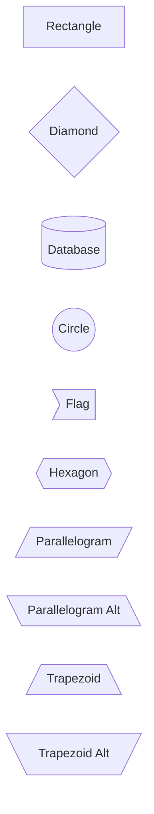

# Mermaid v11+ Complete Shape Reference

All shapes available in Mermaid v11.3+ using the `@{ shape: name }` syntax.
Applies to **flowchart** diagrams.

## Basic Shapes

| Shape | Keyword | Semantic Use |
| :--- | :--- | :--- |
| Rectangle | `rect` (default) | Process, service, function |
| Diamond | `diam` | Decision, branch |
| Hexagon | `hex` | Preparation, condition, initialization |
| Stadium | `stadium` | Terminal, start/end |
| Cylinder | `cyl` | Database, persistent storage |
| Document | `doc` | File, report, document |
| Circle | `circle` | Start/end, simple state |
| Cloud | `cloud` | External service, internet |
| Folder | `folder` | Namespace, module, package |
| Queue | `queue` | Message queue, buffer |
| Parallelogram | `parallelogram` | Input/output, data entry |
| Trapezoid | `trap-t` | Manual operation, intervention |
| Trapezoid Alt | `trap-b` | Alternative manual step |
| Rounded | `rounded` | Soft process, UX step |
| Subroutine | `subroutine` | Predefined process, helper |
| Triangle | `tri` | Alert, flag, warning |
| Notched Rectangle | `notch-rect` | Form, document with tab |
| Notched Pentagon | `notch-pent` | Receipt, stub |
| Lean Right | `lean-r` | Variation, derivative |
| Lean Left | `lean-l` | Variation, derivative (mirror) |
| Flag | `flag` | Milestone, marker, endpoint |
| Odd | `odd` | Asymmetric condition, exception |

## Document Variants

| Shape | Keyword | Use case |
| :--- | :--- | :--- |
| Lined Document | `lin-doc` | Ruled document, form template |
| Multiple Documents | `docs` | Document set, batch processing |
| Manual File | `manual-file` | Physical file, paper record |
| Manual Input | `manual-input` | User prompt, keyboard entry |
| Paper Tape | `paper-tape` | Legacy output, teletype |
| Slanted Rectangle | `sl-rect` | Off-page connector, external ref |
| Rectangle with Divider | `div-rect` | Split process, two-phase |
| Window Pane | `win-pane` | Window, viewport, panel |
| Framed Circle | `f-circ` | Terminator variant, focus |

## Special Shapes

| Shape | Keyword | Use case |
| :--- | :--- | :--- |
| Bolt | `bolt` | Rapid action, lightning process |
| Bang | `bang` | Exclamation, alert |
| Brace | `brace` | Grouping decorator (left) |
| Brace R | `brace-r` | Grouping decorator (right) |
| Braces | `braces` | Double-sided grouping |
| Fork | `fork` | Parallel split, concurrency start |
| Hourglass | `hourglass` | Timed process, wait state |
| Delay | `delay` | Waiting period, timeout |
| Horizontal Cylinder | `h-cyl` | Wide storage, disk array |
| Lined Cylinder | `lin-cyl` | Structured storage, index |
| Curved Trapezoid | `curv-trap` | Curved process, pipeline |
| Flip Triangle | `flip-tri` | Inverted alert, reversed condition |
| Stored Rectangle | `st-rect` | Cache, memory store |

## Syntax

Two equivalent forms:

```mermaid
flowchart LR
    # Shape-only syntax
    A@{ shape: cyl }

    # Shape with label
    B@{ shape: diam, label: "Decision" }
```

## Color Styling

```mermaid
flowchart LR
    A@{ shape: rect, label: "API Service" }:::service
    classDef service fill:#3b82f6,stroke:#1e40af,color:#fff
```

## Legacy Syntax (still supported)


